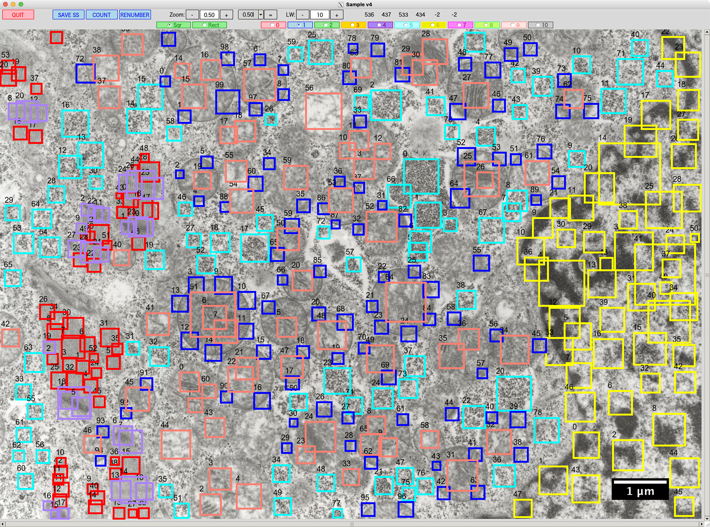
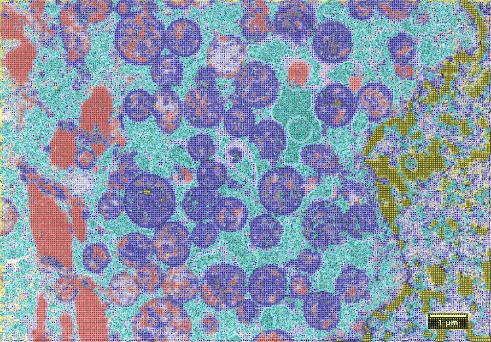
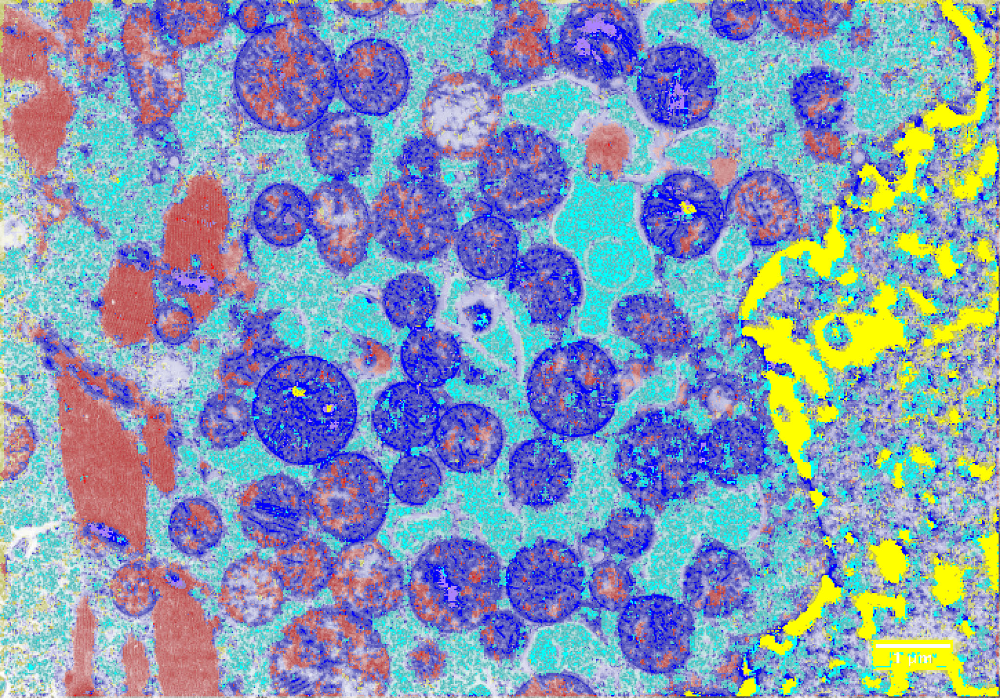

# CNN-TLFC
**Transfer learning (Fine-tuning) of a CNN model**

## H&E stain image
### Transfer learning
<table>
<tr>
<td></td>
<td></td>
<td></td>
</tr>
</table>

### Fine-tuning

## TEM (Transmission electron microscope) image
<table>
<tr>
<td></td>
<td></td>
<td></td>
</tr>
</table>
