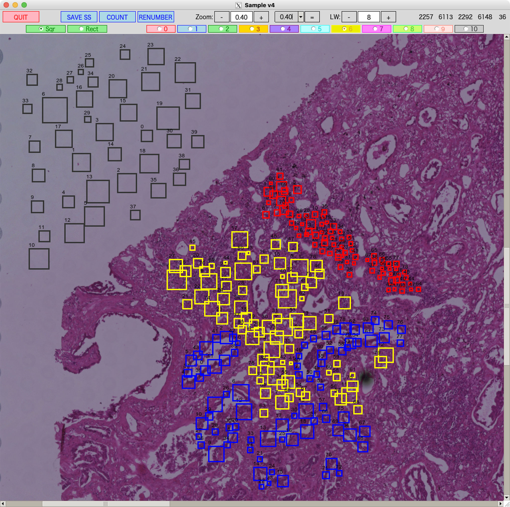
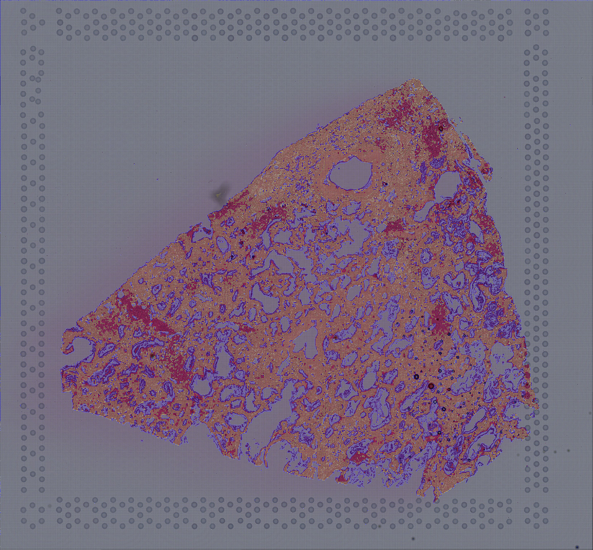
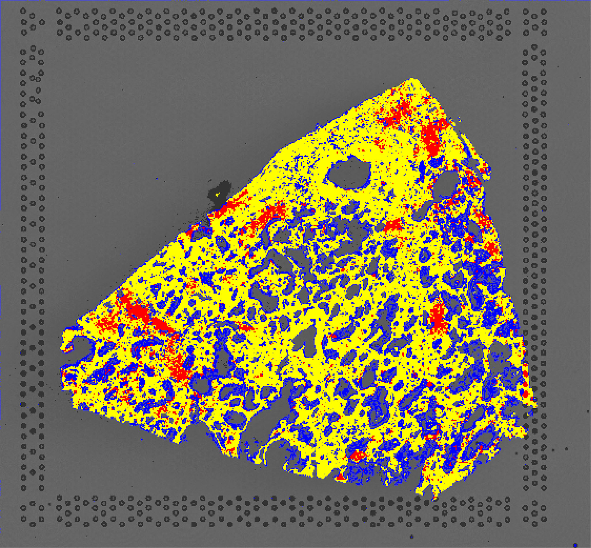
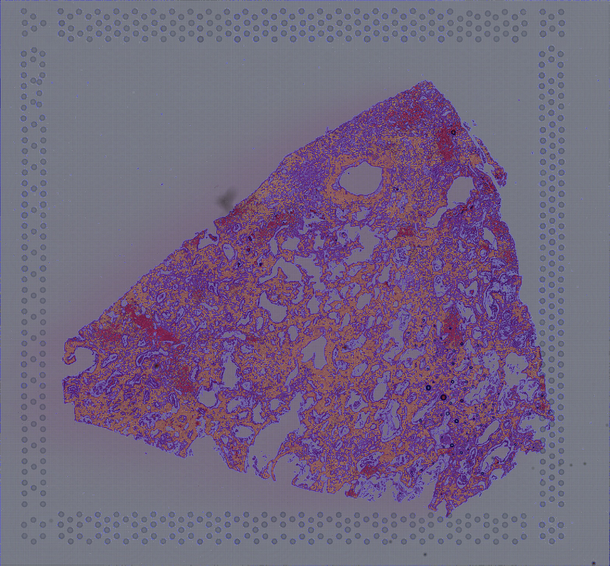
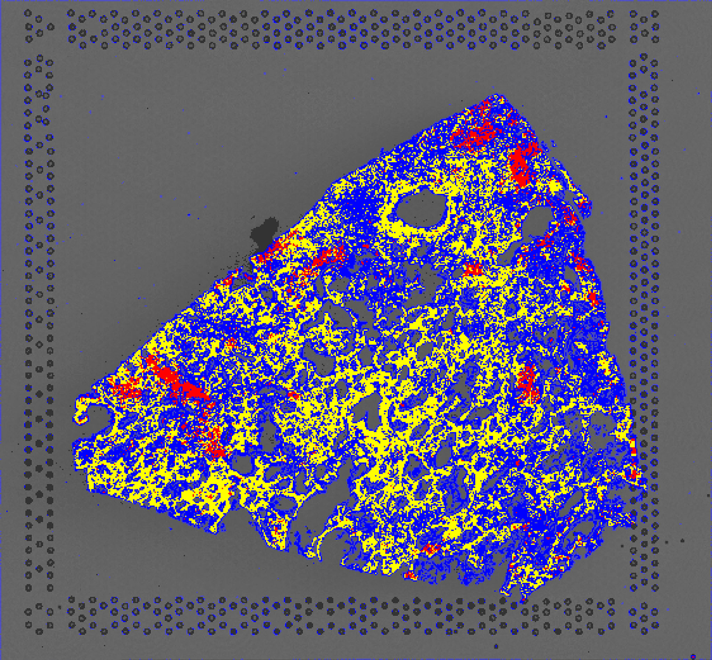
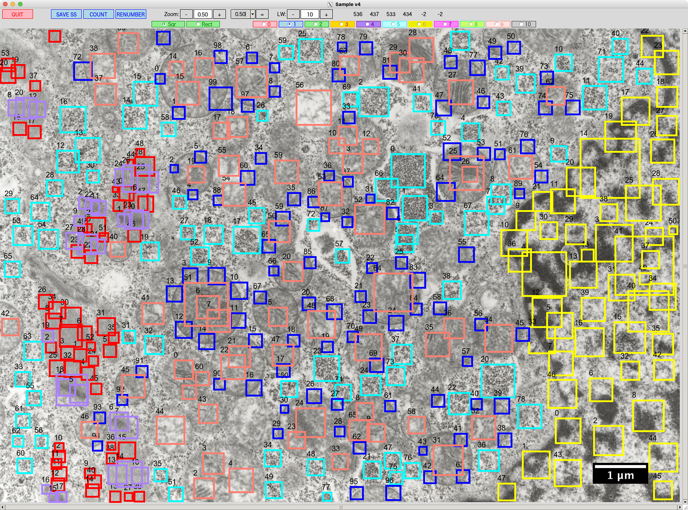
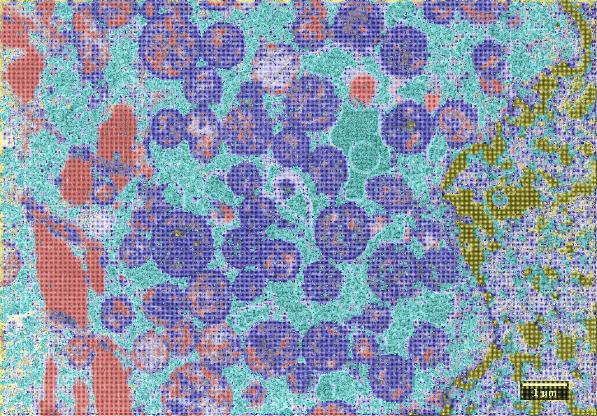
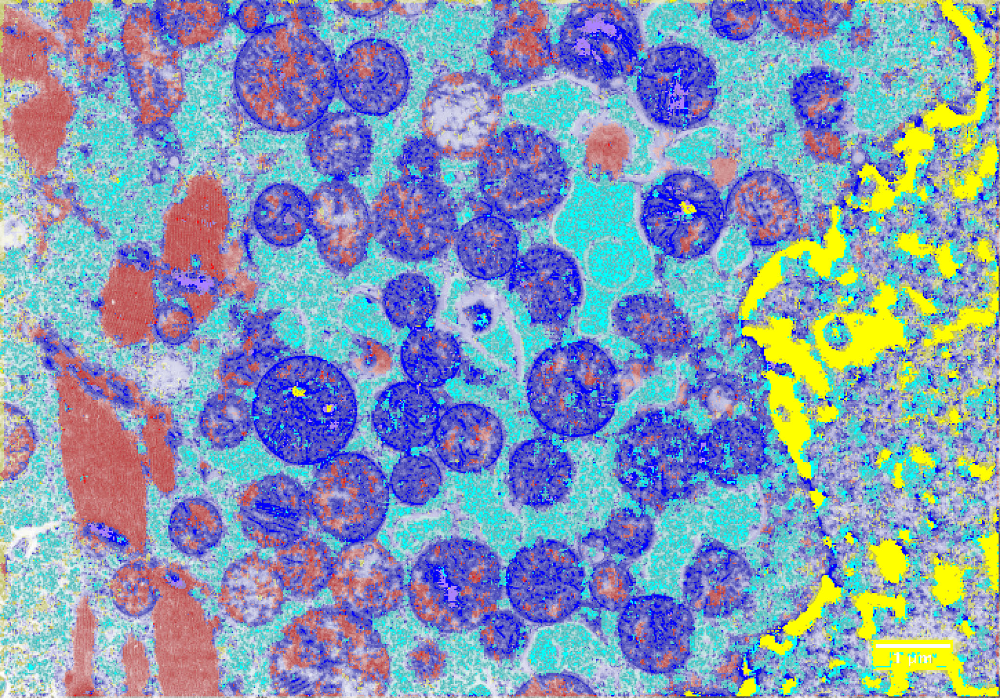

# CNN-TLFT
**Transfer learning (Fine-tuning) of a CNN model**

## H&E stain image
### Fine-tuning
Train the entire model (ResNet18+ImageNet) with new data.
<table>
<tr>
<td></td>
<td></td>
<td></td>
</tr>
</table>

### Transfer learning (in its narrow sense)
Train the last layer of the model (ResNet18+ImageNet) with new data.
<table>
<tr>
<td></td>
<td></td>
<td></td>
</tr>
</table>

## TEM (Transmission electron microscope) image
<table>
<tr>
<td></td>
<td></td>
<td></td>
</tr>
</table>
